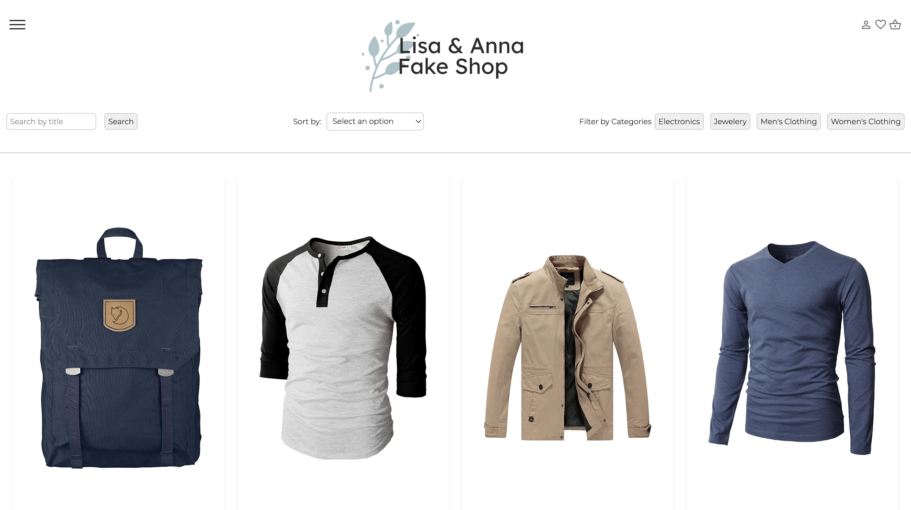

# Fake Shop Application

> 

## Overview
This application allows users to browse, filter, and sort products from a fake store API. It includes functionality for searching products, adding them to a cart, and marking them as favorites.

## Features
- **Fetch Products:** Retrieve products from the Fake Store API.
- **Filter by Category:** Electronics, Jewelery, Men's Clothing, Women's Clothing.
- **Search Products:** Search for products by text.
- **Sort Products:** Sort by price and rating, both ascending and descending.
- **Add to Cart:** Add products to the shopping cart.
- **Mark as Favorite:** Toggle products as favorites.

## Usage
1. **Start Application:**
   - The application fetches and displays all products on load.

2. **Filter by Category:**
   - Click on a category button (Electronics, Jewelery, Men's Clothing, Women's Clothing) to filter products by category.

3. **Search Products:**
   - Enter text in the search bar and click "Search" to find products.

4. **Sort Products:**
   - Select a sorting option from the dropdown menu to sort products.

5. **Add to Cart:**
   - Click "Add to Cart" on any product to add it to your cart.

6. **Mark as Favorite:**
   - Click the heart icon on any product to mark it as a favorite.

## Components
- **Search Bar:** Input field for searching products.
- **Filter Buttons:** Buttons to filter products by category.
- **Sort Dropdown:** Dropdown menu to sort products.
- **Product Display:** Main area displaying products.
- **Status Display:** Area showing the status of search results.

## Live Demo
Try the application live: [FakeShop](https://lisayl1688.github.io/FakeShop/)

## License
Licensed under the MIT License.

Enjoy browsing and shopping!
